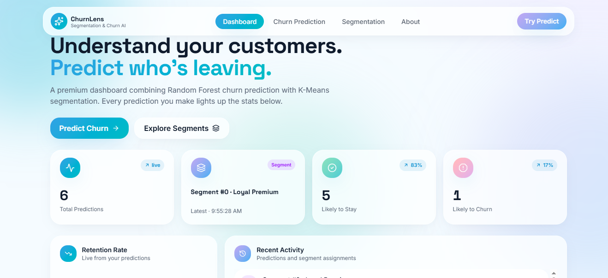
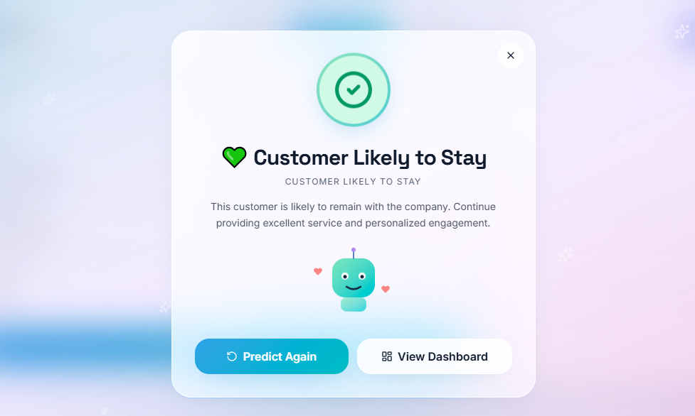
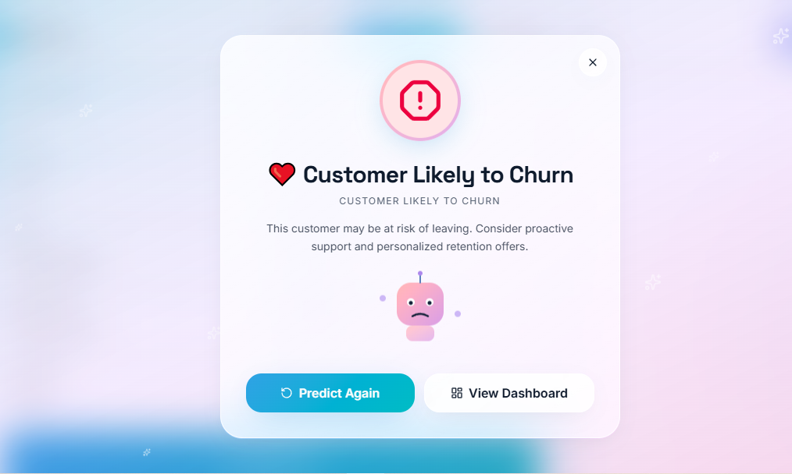
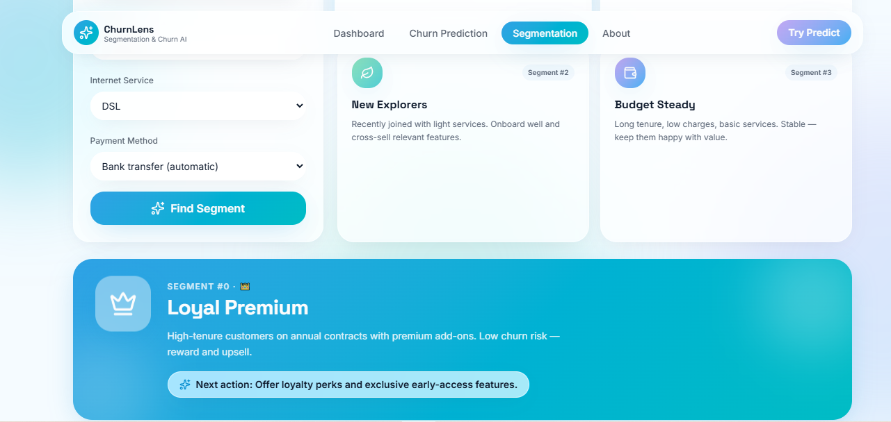
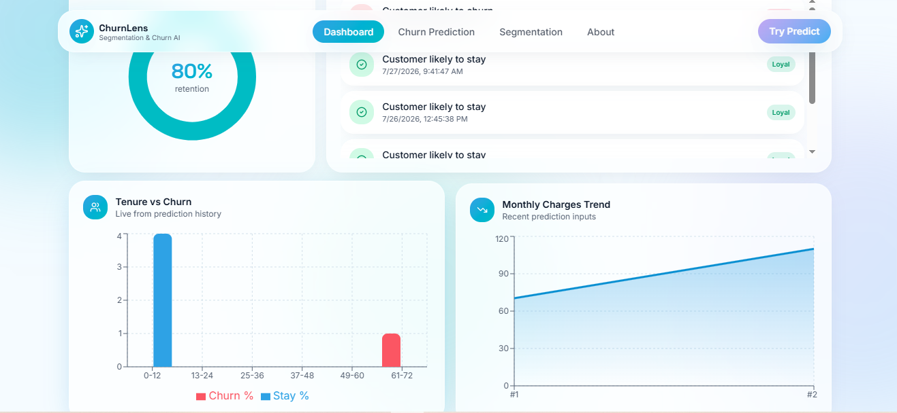

# Customer Segmentation & Churn Analysis

## Project Overview

Customer Segmentation & Churn Analysis is a Machine Learning project that analyzes customer behavior and predicts whether a customer is likely to leave a service.

The project combines customer churn prediction and customer segmentation to help businesses understand their customers and take better retention decisions.

---

## Objectives

- Predict customers who are likely to churn.
- Segment customers into different groups based on their characteristics.
- Provide insights into customer behavior using Machine Learning.
- Build an API-based ML application using Flask.

---

## Machine Learning Algorithms Used

### 1. Churn Prediction

**Algorithm Used:**
- Random Forest Classifier

**Purpose:**
- Predict whether a customer will churn or continue using the service.

---

### 2. Customer Segmentation

**Algorithm Used:**
- K-Means Clustering

**Purpose:**
- Group customers into different segments based on their features and behavior.

---

## Technologies Used

- Python
- Pandas
- NumPy
- Scikit-learn
- Flask
- Machine Learning
- GitHub

---

## Features

- Customer churn prediction
- Customer segmentation
- Machine Learning model integration
- Flask REST API backend
- Customer analysis support

---

## Project Structure
Customer-Segmentation-Churn-Analysis/
│ ├── app.py ├── train_model.py ├── segmentation.py ├── customer_churn.csv │ ├── churn_model.pkl ├── segmentation_model.pkl ├── segmentation_scaler.pkl │ └── README.md

---

## API Endpoints

### Home API
GET /

Returns project status.

---

### Churn Prediction API
POST /predict-churn

Predicts whether a customer is likely to churn.

---

### Customer Segmentation API
POST /segment-customer

Returns the customer segment.

---

## 📸 Screenshots

### 🏠 Home

### ✅ Customer Likely to Stay

### ❌ Customer Likely to Churn

### 👥 Customer Segmentation

### 📊 Dashboard

## Future Enhancements

- Deploy the application on cloud platforms.
- Improve model accuracy with larger datasets.
- Add advanced analytics and reporting features.
- Add more customer insights and visualization techniques.

---

## Author

Manshi Singh

B.Tech Data Science
